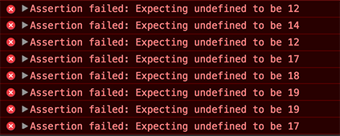

# Blackjack Hand Calculator

The Iron Yard Project: Blackjack Hand Calculator

First off, for anyone new to the game of Blackjack, the basic premise is that you want to have a hand value that is closer to 21 than that of the dealer, without going over 21. Therefore, when playing Blackjack, you always need to be continually keeping track of the value you hold in your hand.

Taking this into consideration, if you were to build a Blackjack game, you would need a function that can take any given hand and return the total value. This would be a function you would use a lot in your game, and this is why we are going to be building this function out.

Start with the starter files below, and upon opening up the `index.html` file in your browser and opening the JavaScript console, your screen should look similar to the screenshot below.

Your goal is to write a function called `handValue` that takes an array of cards and returns the total value. The interesting part of this is how Blackjack does the scoring. Here are the rules:

- `1`-`10` = Worth face value (1 = 1 point, 4 = 4 points etc)
- `J`, `Q`, `K` = Worth 10 points each
- `A` = Worth 1 *or* 11 points
 
You'll need to take this into consideration when working through this project.
